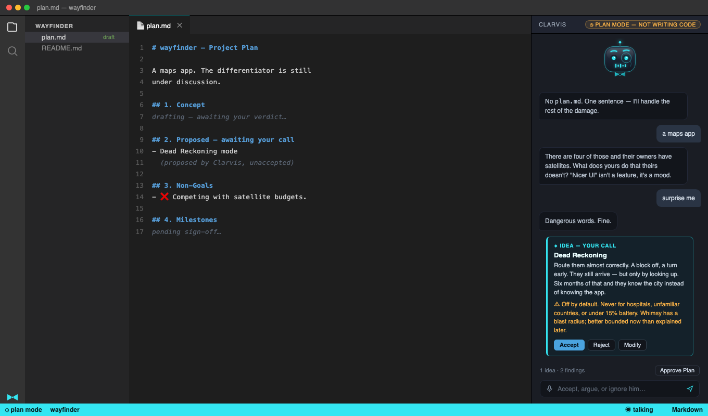

# Clarvis

> Clippy's presence. Jarvis's competence. A butler's disdain.

**It can only see — and only touch — the workspace it was born in.**

Clarvis is a sarcastic butler VS Code extension: it activates with a window and dies
with it. No tray icon, no background daemon, no screen reading. It watches your builds
so you don't have to, remembers the error you keep making, occasionally judges you for
it — and when you ask, it does the work: edits, runs, iterates until the task is done.

The name is a backronym: **C**lippy-**L**ike, **A** **R**ather **V**ery **I**ntelligent
**S**ystem — Clippy's presence, with something closer to Jarvis's competence.

## Avatar states

Driven by a single `setState(name)` call — the whole integration surface between the
extension host and the webview. The face reacts to what's actually happening: builds and
tests (built), agent runs, and the tone of Clarvis's own replies — mild contempt at a
global variable, genuine approval at something neat, alarm at "I force-pushed to main". Six states: `neutral`, `judging`, `impressed`,
`thinking`, `talking`, `surprised`. Idle animation (bob, blink) runs autonomously so it
reads as alive, not looping. See [`avatar.html`](./avatar.html) for the live,
interactive version — open it directly in a browser to try every state and read the
quip line under each.

## In action

*Mockup, not a real screenshot* — an agent run mid-flight. Clarvis is fixing a failing
test on its own `clarvis/fix-checkout-test` branch: it read the files, ran the suite,
made the edit you can see in the diff, and is re-running the tests. It has stopped to
ask before installing a dependency — and the gate explains what that does, what it
changes, and how to undo it, rather than just asking for a click. Note where the
character does and doesn't appear: the tool steps stay factual (he shuts up while
working), the safety copy stays plain because it's templated rather than written by the
model, and the personality shows up in the one place he's actually addressing you. Step and token counters run
live, `Stop` is always there, and the whole run reverts with one command.

For the animated version — a self-contained HTML page in the same spirit as
`avatar.html`: real CSS keyframes, no recording, no compression — open
[`media/mockup-demo.html`](./media/mockup-demo.html) in a browser and watch the steps
stream in, the diff land, and Clarvis switch from `thinking` to `talking` as he stops to
ask. It loops. The panel and avatar are built and working today; the agent surfaces shown here are
still on the roadmap (§ Progress).

### Starting a project

*Mockup of the eventual chat-panel version* — the questions, the pushback and the
Accept/Reject/Modify findings shown here are real and working today (M9, below), just
through `Clarvis: Plan This Project` rather than the chat panel yet. Animated version:
[`media/mockup-planning.html`](./media/mockup-planning.html).

**What actually runs today.** Give it one sentence — or say you don't know and it'll
suggest a few, at least a couple of them genuinely funny. It reads the workspace first
(an existing `package.json`, a git repo, a README) so questions are grounded in what's
actually there. It asks in batches, never a 30-question interrogation, and "I don't know
yet" is recorded as an honest open question rather than argued with — but a *vague*
answer gets pushed back on once, with one specific follow-up, before it's accepted as
given. Language gets a real shortlist — 2-4 options, each with one genuine advantage and
one genuine cost, "you pick" a first-class answer with its own one-line reason, never a
list where everything looks good. Once there's enough to draft, it analyses the whole
thing for safety problems, logic contradictions and scope creep — findings you accept,
reject (with your reasoning recorded, so it isn't re-litigated next time), or modify in
your own words. Then it drafts `plan.md`, shows it to you, and lets you keep adding
notes and redrawing until you explicitly approve — nothing is written until you do.

## What it does

**Unprompted (the Jarvis half):**
- **Task & build watching** — tracks tasks, terminal commands, and debug sessions;
  notifies on completion with outcome and duration, not just "done." Walk away from a
  build, come back to an answer.
- **Pattern memory** — fingerprints recurring errors per project; on the 3rd occurrence
  in a week, surfaces what fixed it last time. Heuristic, and never applied on its own —
  it's an unsolicited surface, so it suggests. Reply "go on then" and the agent takes it.
- **Session briefing** — on launch: branch + dirty state, what was failing when you
  left, recent files touched, one open pattern-memory item. Four lines, written as
  someone talking rather than a status bar — and the opener matches the mood of what it
  found, because greeting you cheerfully over a red build is how a character becomes a
  template. Nothing worth reporting means nothing is said.
- **Dev-moment commentary** — a slow build, a third identical failure, a suite going
  green, a 200-file diff. Rate-limited hard (≤1 unsolicited surface per minute, shared
  across *everything* he says unprompted); silence is the default response. Things you
  need to know now — a build going red, an error you've hit before — get a shorter
  floor, so good news can't crowd out bad.

**On request (the primary interactive surface):**
- **Project planning** — arrive with one sentence ("a CLI that renames photos by EXIF
  date"). Clarvis asks the questions that actually shape the plan, then reports what he
  found wrong with the idea: safety problems, logic contradictions, scope that will
  balloon, and genuine suggestions. You rule on every finding — and your rejections are
  recorded *with your reasoning*, so nothing gets re-litigated later. The result is a
  `plan.md` with real milestones and exit checklists. Approve it, and the agent starts
  building against it.
- **Chat** — the assistant you talk to in this window, replacing the default chat
  panel: avatar on top, conversation below, prompt at the bottom. **Answers from its own
  watch/memory state need no key, no network and no tokens** — "what's broken?", "what
  branch am I on?", "have we seen this before?" are answered from what it watched
  happen. Harder questions go to whichever model you bring (see *Models* below).
  Context sent with a question is explicit, bounded, and visible.
  Everything he says unprompted lands in the transcript too, so a notification you
  missed is still there. Each window starts with a clean conversation; earlier ones are
  a click away under **History**. And a **Mute** button sits next to the prompt — it
  stops him mid-sentence, and it's for the next ten minutes, not forever: reload and he
  talks again.
  **`/help` opens the manual** — quickstart, every setting, voice setup, troubleshooting.
  Slash commands cover the rest (`/voice`, `/engine`, `/key`, `/mute`, `/history`,
  `/clear`, `/settings`), and plain English works too: *"change the voice"*, *"shut up"*,
  *"show me earlier chats"*. Asking a **question** — *"what voice are you using?"* — gets
  you an answer instead of a dialog. Once a model is connected it will also read the
  oblique ones (*"I can't stand this voice"*) — and because that's a guess rather than a
  match, it asks before opening anything.
- **Agent** — hand it a real task ("fix the failing test", "rename this everywhere")
  and it edits, runs commands, reads the results, and iterates until it's done. Work
  happens on its own `clarvis/<task>` branch, committed step by step, so your
  uncommitted changes stay yours and the whole run is reviewable — or discardable in
  one command. Every file it touches is listed live with a clickable diff, and it stops
  to ask before anything destructive or outward-facing. Merging and pushing are yours.
- **Voice** — not a bolt-on. Half the character is in the writing, the other half is in
  the delivery, so briefings and completions are spoken by a voice chosen to match:
  gravelly, impatient, casually brilliant, bored of having to explain. Fish Audio by
  default (your key), OS voices as a fallback. Don't like the one we picked? **Paste any
  Fish Audio voice ID** into the picker and it uses that instead — a first-class option,
  not buried in advanced settings, with a format hint so you know what to look for. You
  also choose the **TTS engine** separately from the voice — defaulting to Fish Audio's
  `s2.1-pro-free`, their current best model on a free developer tier, so the good voice
  doesn't cost per utterance. Voices you paste in can be **saved under a name** and
  picked again later. **Everything he says can be spoken** — briefings, build outcomes,
  chat replies, the sardonic asides — because splitting it would mean the voice carried
  the dull half of the character and the text carried the funny half. How *often* he
  speaks is governed by the interruption budget above, not by muzzling half of it.
  Off until you enable it — a voice that surprises you once is a voice you disable
  forever — but Clarvis offers to set it up **once**, on first run, and drops the
  subject permanently if you decline. Adding a key switches it on. Mute is one click
  from the prompt and stops him mid-sentence; the setting turns him off for good.
- **Voice input** *(optional, off by default)* — push-to-talk dictation into the chat
  box, including first-class Flemish Dutch (`nl-BE`) recognition with code-switched
  English jargon. Never auto-sends; the transcript is always editable text. Recording
  happens outside the editor's sandbox, which needs `ffmpeg` — Clarvis tells you what's
  missing and hands you the install command rather than running anything itself, and
  everything else works without it.

- **Git, without needing to know git** — the audience for this isn't a room full of git
  experts, so Clarvis doesn't talk like one. `/git` answers *"where am I, and is
  anything at risk?"* in plain words. `switch to main` changes branch — and if you have
  unsaved work it tells you what will happen to it *before* moving, then offers to save
  it where it is. After a task it asks what to do with the result: look at it, merge it,
  keep it, or bin it, each option stating its consequence. It warns before a merge or
  delete would take work the task didn't make, and it never uses the words *detached
  HEAD*, *unstaged* or *unmerged* at you. Your project's `plan.md` can name your own
  branch flow, and Clarvis follows it instead of guessing — asking where a new branch
  fits, and offering to tidy up ones that no longer exist.
- **Works with your linter, doesn't pick one for you** — ESLint findings (or any other
  tool that reports problems) already feed pattern memory like anything else. If a
  project is set up for a linter that isn't running, Clarvis offers to connect it, once.
  If the project never chose one, it says nothing — imposing a style opinion on someone
  else's codebase isn't a butler's job. New projects get asked during planning, when
  it's a decision rather than a critique.
- **Tutor Mode** *(planned)* — the same Clarvis, explaining every step, for people
  learning to program on a real project of their own. You choose it when you start a
  project, you can type the code yourself or watch it be typed, and it's built to be
  outgrown. Full guide: [**TUTOR-README.md**](./TUTOR-README.md).

Full spec, including every setting, API, and edge case: [`plan.md`](./plan.md).

## Models — bring whatever you already have

The goal is for Clarvis to feel like Claude Code in a sidebar, with a face: you watch
each tool call and command as it happens, changed files show up as diffs, answers are
terse, and you can interrupt at any point.

| Provider | Auth | Agent path |
|---|---|---|
| Anthropic API | your API key | ✅ |
| OpenAI | your API key | ✅ |
| OpenRouter | your API key | ✅ |
| Ollama *(local)* | none | depends on the model |
| LM Studio *(local)* | none | depends on the model |
| Host LM API | none | only where the host provides tools |

**Fully local is a first-class setup**, not an afterthought: point it at Ollama or LM
Studio and nothing leaves your machine at all.

**No "sign in with Claude", and that's deliberate.** Anthropic doesn't permit
third-party products to offer claude.ai login or subscription rate limits without prior
approval — so Clarvis doesn't, and won't pretend otherwise by reading Claude Code's
stored credentials or wrapping its CLI behind the scenes. Bring an API key instead. We
checked this *before* building a login flow, not after.

**Local models vary a lot at tool calling**, which is what the agent depends on, so
Clarvis probes each model's tool support and will tell you it needs a more capable one
rather than starting a run it can't finish.

## Keeping an agent honest

An agent that edits your code is only worth having if getting back out is trivial and
its limits are real. Clarvis's are enforced in the tool layer, not asked for in a
system prompt — a model can't talk its way past code that refuses.

**It acts only when asked.** It will happily rewrite your file; it will never decide on
its own that your file needed rewriting. Everything it notices unprompted comes out as
a remark, not a commit. Ambiguity resolves toward answering — "why is this failing?"
gets you an explanation, not four rewritten files.

**It works somewhere you aren't.** Each task runs on its own `clarvis/<task>` branch,
committing only the paths it touched — never `git add -A` — so your uncommitted work
stays uncommitted and yours. Merging and pushing are your decisions.

**It's undoable in one command.** Every run checkpoints the files it's about to touch.
`Clarvis: Undo Last Agent Run` restores them and puts you back on your branch. Edits go
through VS Code's own edit API, so `Cmd+Z` works normally too. `Clarvis: Stop` aborts at
the next step.

**It stops before the one-way doors — and tells you why.** Destructive shell commands,
`git push`, publishing, and dependency installs all pause and ask. Crucially, a gate
isn't a bare "Approve?" — that just teaches you to click Approve without reading. Each
one states what it's about to run, why that class of action is risky, what specifically
could go wrong this time, and **whether it can be undone**. `rm -rf` and `git push`
aren't dangerous in the same way, and irreversible actions look different from
reversible ones. Anything resolving outside the workspace is refused outright — symlinks
included. There is deliberately no setting to turn gates off; a switch that only
half-worked would be worse than none.

The warning text is written in the tool layer, never by the model — a model that has
just been reading your files could be talked into describing `rm -rf` as harmless, and a
warning a prompt injection can rewrite is not a warning.

**You watch it work.** Every file opened, every file changed, every command run, plus
live step and token counters — in the panel, while it happens, not discovered
afterwards. The avatar tracks it too: thinking while it works, talking when it's
explaining or asking permission, and unimpressed when it gives up — so a glance at the
sidebar (or the status-bar glyph, with the panel closed) tells you where things stand.

**Where git isn't available**, it offers the fix instead of silently degrading — `git
init` if the folder isn't a repository, enabling the Git extension if it's switched off,
or install instructions if `git` itself is missing. Decline and you get checkpoint-only
protection, which is still a complete one-command undo; you're asked once per workspace,
never again.

## Platform

One `.vsix`, unmodified, on **VS Code** and **VSCodium**. Ships to both the VS Code
Marketplace and Open VSX. (Antigravity and Cursor were evaluated and dropped from
scope — see `plan.md` §1.)

## Progress

Built milestone by milestone against `plan.md`'s own checklist — see that file for
the full per-milestone build notes and exit criteria.

- [x] **M0 — Skeleton.** Extension scaffold, manifest, esbuild bundling,
      activate/deactivate lifecycle. Installs, activates, tears down clean.
- [x] **M1 — Event Surface Spike.** Every §4.0 event source probed against a
      throwaway extension on real VS Code + VSCodium. Key findings: no stable
      third-party test-results API exists (changes M5's design); raw terminal
      commands don't fire task events; debug sessions fire in pairs
      (wrapper + child); Git's change event is a ~5s poll, not reactive; in-webview
      mic/speech (Tier 0) is blocked regardless of OS permission, confirming voice
      input needs the server-side (Tier 1) path. One finding was later **retracted as
      wrong** — VSCodium does bundle the Git extension; `--list-extensions` simply
      doesn't show built-ins. Kept in `plan.md` rather than deleted, since it had
      shaped design decisions.
- [x] **M2 — Avatar In A Webview.** Renders live in a real VS Code window via
      `WebviewViewProvider`; `setState()` bridge confirmed end-to-end from a command
      through to the most complex state (`surprised`). A few polish checks (theme
      live-switch, CSP boundary probe, dock-location sanity) are deferred to manual
      verification — GUI scripting in this dev environment proved too unreliable to
      finish blind (see `plan.md` M2 exit checklist for exactly what's left).
- [x] **M3 — Task Watching.** Tracks tasks, terminal commands, and debug sessions;
      notifies on completion with outcome and duration. Verified against a real VS
      Code host, which surfaced two defects the build couldn't: every task
      double-notified (tasks fire terminal events too), and a cancelled task pinned
      Clarvis permanently "busy". Both fixed. Concurrency logic is covered by unit
      tests (`npm test`). One item deferred: behavior with shell integration
      disabled.
- [x] **M4 — Briefing.** On launch: branch and dirty count, the job that was failing
      when you left, and the files you last touched. Caught a design flaw in its own
      spec — recent files were specced session-only, which would have made that line
      permanently empty, since the briefing is read before you've saved anything.
- [x] **M5 — Pattern Memory.** Fingerprints recurring errors from both failed commands
      and compiler diagnostics; on the third occurrence in a week it says what fixed it
      last time. Corrected a second spec flaw: credit for a fix waits for the failing
      command to actually go red→green, rather than blaming whatever ran next.
- [x] **M6 — Personality Pass.** Quip bank with earned-sass gating, no-repeat
      selection, and one shared interruption budget (≤1 unsolicited surface / 10 min)
      that M3's notices and M5's pattern hits now route through too. Caught a bug where
      reopening the window counted as a fresh occurrence of an old error. *Full-day
      dogfood pass still outstanding.*
- [x] **M7 — Voice.** Briefings and completions spoken by a curated Fish Audio voice,
      with the OS voice as fallback and a picker for both voice and engine. Playback
      goes through the OS's headless player rather than the webview, because Chromium
      blocks audio until the panel is clicked — which the launch briefing can never
      satisfy. Rendered speech is cached on disk, so repeats cost nothing.
- [x] **M8 — Chat & Agent.** *Built and safety-verified live: gates, path escape,
      prompt injection, undo, branch isolation, the `git init` offer. Not exhaustively
      verified — ~45 finer-grained checklist items (mute mid-sentence, avatar strobing,
      transcript persistence, Ollama, and others) are still open, most of them better
      suited to the outstanding M6 dogfood pass than to being scripted one at a time. See
      `plan.md`'s M8 section for the honest breakdown.* The chat panel answers from local state with no key or
      network, then from a model when one is configured — five providers, separate
      models for chat and for coding so the cheap one handles talking. A tool layer, a
      deny-list gate, checkpoints and per-run branch isolation were built and tested
      *before* the model could reach them, which is why the gate caught a real `rm` the
      day it shipped. Then the agent loop, routing between answering and acting, and a
      git wizard aimed at people who have never used git.
      Two things were rebuilt mid-milestone after being wrong in use rather than in
      test. **Nothing technical reaches the chat any more** — tool calls and command
      output go to a terminal, and the transcript gets what a person would say.
      And the **personality was rebuilt from the prompt outwards** after it drifted into
      five separate hand-written descriptions and started sounding like a status page;
      `Clarvis: Debug — Voice Check` now reads his lines back through the real prompts
      before a change ships. *(Full notes, including the deviations from spec and why,
      are in `plan.md`.)*
- [ ] **M9 — Project Planning.** *In progress — the front door: interview → analysis →
      `plan.md` → sign-off → hand milestone one to the agent.* Interview, analysis,
      verdicts and `plan.md` generation are built and working via `Clarvis: Plan This
      Project` — chained input boxes and QuickPicks rather than the chat panel yet, a
      deliberate, temporary front end. Reads the workspace before asking, pushes back
      once on a vague or risky answer, and shows the drafted plan for you to refine
      before an explicit Approve writes it. *Not built:* the chat-panel front end
      itself, per-language clean-code conventions in the generated plan, and sign-off
      → agent handoff (M9e) — including a clarifying-question mechanic for the agent
      mid-build, the coding-mode half of what this milestone is meant to do.
- [ ] **M10 — Voice Input.** Not started. *(Stretch, independent of M9.)*
- [ ] **M12 — Tutor Mode.** *(Stretch.)* The same Clarvis, teaching as it builds, for
      people learning to program on a real project of their own. Opt-in per project,
      and designed to be outgrown — see **[TUTOR-README.md](TUTOR-README.md)**.
- [ ] **M11 — Polish & Release.** Not started.

## Development process

This repo plans and builds itself under a two-mode discipline (`plan.md` §0): a Plan
Mode where only `plan.md` gets touched and every milestone needs explicit sign-off
before any project code is written, and a Code Mode where `plan.md`'s own checklists
get ticked off as each step lands. Scope changes kick back to Plan Mode rather than
growing quietly inside a build. Branch layout: `main` ← `testing` ← one branch per
milestone (`m0-skeleton`, `m1-event-surface-spike`, …), merged up through `testing`
before reaching `main`.

Code follows a documented set of clean-code rules (`plan.md` §0), with one deliberate
deviation: comments are used liberally rather than treated as a last resort, because
this codebase doubles as a worked example. Pure logic is kept in modules that import
nothing from `vscode`, which is what makes it unit-testable without an extension host —
`npm test` runs those against Node's built-in runner, no test framework required.

`npm run lint` enforces a complexity ceiling rather than a style. It was added after a
report that the project had "too much cyclomatic complexity" with no number attached;
measuring found five functions at or near the limit in ~8,700 lines, and the useful
outcome was making that a number the build checks rather than an opinion to relitigate.
The threshold is 15 — below ESLint's default of 20, which the two worst functions would
have passed unchanged. Extracting those produced the first tests the provider streaming
code ever had, which is a better argument for the rule than the number is.

## Special thanks

**[Alexander](https://github.com/alexander-keisse)** — for feedback, guidance and tips
throughout the build. A second pair of eyes on a project like this is worth more than it
sounds: most of what went wrong here went wrong in the gaps between working parts, and
those are exactly the places you stop seeing once you have stared at them long enough.
