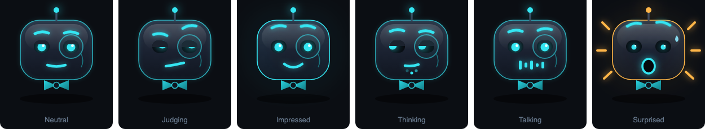
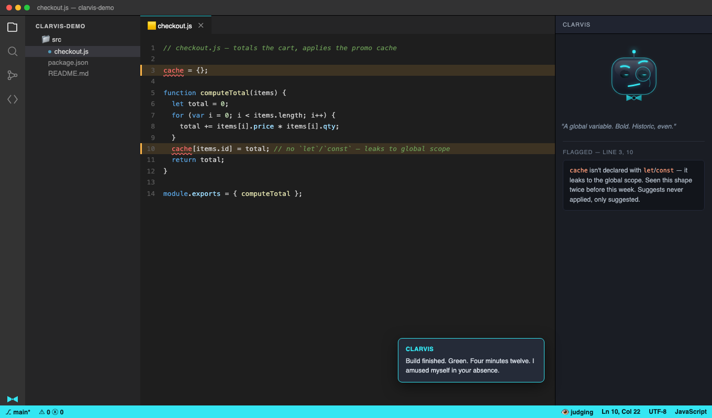

# Clarvis

> Clippy's presence. Jarvis's competence. A butler's disdain.

**It can only see — and only touch — the workspace it was born in.**

Clarvis is a sarcastic butler VS Code extension: it activates with a window and dies
with it. No tray icon, no background daemon, no screen reading. It watches your builds
so you don't have to, remembers the error you keep making, occasionally judges you for
it — and when you ask, it does the work: edits, runs, iterates until the task is done.

The name is a backronym: **C**lippy-**L**ike, **A** **R**ather **V**ery **I**ntelligent
**S**ystem — Clippy's presence, with something closer to Jarvis's competence.

## Avatar states

Driven by a single `setState(name)` call — the whole integration surface between the
extension host and the webview. The face reacts to what's actually happening: builds and
tests (built), agent runs, and the tone of Clarvis's own replies — mild contempt at a
global variable, genuine approval at something neat, alarm at "I force-pushed to main". Six states: `neutral`, `judging`, `impressed`,
`thinking`, `talking`, `surprised`. Idle animation (bob, blink) runs autonomously so it
reads as alive, not looping. See [`avatar.html`](./avatar.html) for the live,
interactive version — open it directly in a browser to try every state and read the
quip line under each.

## In action

*Mockup, not a real screenshot* — an agent run mid-flight. Clarvis is fixing a failing
test on its own `clarvis/fix-checkout-test` branch: it read the files, ran the suite,
made the edit you can see in the diff, and is re-running the tests. It has stopped to
ask before installing a dependency — and the gate explains what that does, what it
changes, and how to undo it, rather than just asking for a click. Step and token counters run
live, `Stop` is always there, and the whole run reverts with one command.

For the animated version — a self-contained HTML page in the same spirit as
`avatar.html`: real CSS keyframes, no recording, no compression — open
[`media/mockup-demo.html`](./media/mockup-demo.html) in a browser and watch the steps
stream in, the diff land, and Clarvis switch from `thinking` to `talking` as he stops to
ask. It loops. The panel and avatar are built and working today; the agent surfaces shown here are
still on the roadmap (§ Progress).

## What it does

**Unprompted (the Jarvis half):**
- **Task & build watching** — tracks tasks, terminal commands, and debug sessions;
  notifies on completion with outcome and duration, not just "done." Walk away from a
  build, come back to an answer.
- **Pattern memory** — fingerprints recurring errors per project; on the 3rd occurrence
  in a week, surfaces what fixed it last time. Heuristic, and never applied on its own —
  it's an unsolicited surface, so it suggests. Reply "go on then" and the agent takes it.
- **Session briefing** — on launch: branch + dirty state, what was failing when you
  left, recent files touched, one open pattern-memory item. Four lines, then silence.
- **Dev-moment commentary** — a slow build, a third identical failure, a suite going
  green, a 200-file diff. Rate-limited hard (≤1 unsolicited surface / 10 min); silence
  is the default response.

**On request (the primary interactive surface):**
- **Project planning** — arrive with one sentence ("a CLI that renames photos by EXIF
  date"). Clarvis asks the questions that actually shape the plan, then reports what he
  found wrong with the idea: safety problems, logic contradictions, scope that will
  balloon, and genuine suggestions. You rule on every finding — and your rejections are
  recorded *with your reasoning*, so nothing gets re-litigated later. The result is a
  `plan.md` with real milestones and exit checklists. Approve it, and the agent starts
  building against it.
- **Chat** — the assistant you talk to in this window, replacing the default chat
  panel. Answers from its own watch/memory state need no key or network; harder
  questions go to whichever model you bring (see *Models* below). Context sent with a
  question is explicit, bounded, and visible.
- **Agent** — hand it a real task ("fix the failing test", "rename this everywhere")
  and it edits, runs commands, reads the results, and iterates until it's done. Work
  happens on its own `clarvis/<task>` branch, committed step by step, so your
  uncommitted changes stay yours and the whole run is reviewable — or discardable in
  one command. Every file it touches is listed live with a clickable diff, and it stops
  to ask before anything destructive or outward-facing. Merging and pushing are yours.
- **Voice** — not a bolt-on. Half the character is in the writing, the other half is in
  the delivery, so briefings and completions are spoken by a voice chosen to match:
  gravelly, impatient, casually brilliant, bored of having to explain. Fish Audio by
  default (your key), OS voices as a fallback. Don't like the one we picked? **Paste any
  Fish Audio voice ID** into the picker and it uses that instead — a first-class option,
  not buried in advanced settings, with a format hint so you know what to look for. You
  also choose the **TTS engine** (quality vs. speed vs. cost), separately from the
  voice. Still off until you enable it: a voice that
  surprises you once is a voice you disable forever.
- **Voice input** *(optional, off by default)* — push-to-talk dictation into the chat
  box, including first-class Flemish Dutch (`nl-BE`) recognition with code-switched
  English jargon. Never auto-sends; the transcript is always editable text.

Full spec, including every setting, API, and edge case: [`plan.md`](./plan.md).

## Models — bring whatever you already have

The goal is for Clarvis to feel like Claude Code in a sidebar, with a face: you watch
each tool call and command as it happens, changed files show up as diffs, answers are
terse, and you can interrupt at any point.

| Provider | Auth | Agent path |
|---|---|---|
| Anthropic API | your API key | ✅ |
| Claude subscription | sign in with your Claude account | ⏳ feasibility being verified first |
| OpenAI | your API key | ✅ |
| OpenRouter | your API key | ✅ |
| Ollama *(local)* | none | depends on the model |
| LM Studio *(local)* | none | depends on the model |
| Host LM API | none | only where the host provides tools |

**Fully local is a first-class setup**, not an afterthought: point it at Ollama or LM
Studio and nothing leaves your machine at all.

Two things stated plainly rather than glossed over. Whether a third-party extension may
authenticate against a **Claude subscription** — technically and under Anthropic's terms
— is being verified before any login flow gets built; if the answer is no, that row
disappears and the API-key path is unaffected. And **local models vary a lot at tool
calling**, which is what the agent depends on, so Clarvis probes each model's tool
support and will tell you it needs a more capable one rather than starting a run it
can't finish.

## Keeping an agent honest

An agent that edits your code is only worth having if getting back out is trivial and
its limits are real. Clarvis's are enforced in the tool layer, not asked for in a
system prompt — a model can't talk its way past code that refuses.

**It acts only when asked.** It will happily rewrite your file; it will never decide on
its own that your file needed rewriting. Everything it notices unprompted comes out as
a remark, not a commit. Ambiguity resolves toward answering — "why is this failing?"
gets you an explanation, not four rewritten files.

**It works somewhere you aren't.** Each task runs on its own `clarvis/<task>` branch,
committing only the paths it touched — never `git add -A` — so your uncommitted work
stays uncommitted and yours. Merging and pushing are your decisions.

**It's undoable in one command.** Every run checkpoints the files it's about to touch.
`Clarvis: Undo Last Agent Run` restores them and puts you back on your branch. Edits go
through VS Code's own edit API, so `Cmd+Z` works normally too. `Clarvis: Stop` aborts at
the next step.

**It stops before the one-way doors — and tells you why.** Destructive shell commands,
`git push`, publishing, and dependency installs all pause and ask. Crucially, a gate
isn't a bare "Approve?" — that just teaches you to click Approve without reading. Each
one states what it's about to run, why that class of action is risky, what specifically
could go wrong this time, and **whether it can be undone**. `rm -rf` and `git push`
aren't dangerous in the same way, and irreversible actions look different from
reversible ones. Anything resolving outside the workspace is refused outright — symlinks
included. There is deliberately no setting to turn gates off; a switch that only
half-worked would be worse than none.

The warning text is written in the tool layer, never by the model — a model that has
just been reading your files could be talked into describing `rm -rf` as harmless, and a
warning a prompt injection can rewrite is not a warning.

**You watch it work.** Every file opened, every file changed, every command run, plus
live step and token counters — in the panel, while it happens, not discovered
afterwards. The avatar tracks it too: thinking while it works, talking when it's
explaining or asking permission, and unimpressed when it gives up — so a glance at the
sidebar (or the status-bar glyph, with the panel closed) tells you where things stand.

**Where git isn't available**, it offers the fix instead of silently degrading — `git
init` if the folder isn't a repository, enabling the Git extension if it's switched off,
or install instructions if `git` itself is missing. Decline and you get checkpoint-only
protection, which is still a complete one-command undo; you're asked once per workspace,
never again.

## Platform

One `.vsix`, unmodified, on **VS Code** and **VSCodium**. Ships to both the VS Code
Marketplace and Open VSX. (Antigravity and Cursor were evaluated and dropped from
scope — see `plan.md` §1.)

## Progress

Built milestone by milestone against `plan.md`'s own checklist — see that file for
the full per-milestone build notes and exit criteria.

- [x] **M0 — Skeleton.** Extension scaffold, manifest, esbuild bundling,
      activate/deactivate lifecycle. Installs, activates, tears down clean.
- [x] **M1 — Event Surface Spike.** Every §4.0 event source probed against a
      throwaway extension on real VS Code + VSCodium. Key findings: no stable
      third-party test-results API exists (changes M5's design); raw terminal
      commands don't fire task events; debug sessions fire in pairs
      (wrapper + child); Git's change event is a ~5s poll, not reactive; in-webview
      mic/speech (Tier 0) is blocked regardless of OS permission, confirming voice
      input needs the server-side (Tier 1) path. One finding was later **retracted as
      wrong** — VSCodium does bundle the Git extension; `--list-extensions` simply
      doesn't show built-ins. Kept in `plan.md` rather than deleted, since it had
      shaped design decisions.
- [x] **M2 — Avatar In A Webview.** Renders live in a real VS Code window via
      `WebviewViewProvider`; `setState()` bridge confirmed end-to-end from a command
      through to the most complex state (`surprised`). A few polish checks (theme
      live-switch, CSP boundary probe, dock-location sanity) are deferred to manual
      verification — GUI scripting in this dev environment proved too unreliable to
      finish blind (see `plan.md` M2 exit checklist for exactly what's left).
- [x] **M3 — Task Watching.** Tracks tasks, terminal commands, and debug sessions;
      notifies on completion with outcome and duration. Verified against a real VS
      Code host, which surfaced two defects the build couldn't: every task
      double-notified (tasks fire terminal events too), and a cancelled task pinned
      Clarvis permanently "busy". Both fixed. Concurrency logic is covered by unit
      tests (`npm test`). One item deferred: behavior with shell integration
      disabled.
- [ ] **M4 — Briefing.** Not started.
- [ ] **M5 — Pattern Memory.** Not started.
- [ ] **M6 — Personality Pass.** Not started.
- [ ] **M7 — Voice.** Not started. *(Core, not a stretch: the delivery is half the
      personality. Lands right after the personality pass.)*
- [ ] **M8 — Chat & Agent.** Not started. *(The big one: local answers, then the
      Answer path, then a real agentic harness — tool layer and gates built and tested
      before the model can reach them.)*
- [ ] **M9 — Project Planning.** Not started. *(The front door: interview → analysis →
      `plan.md` → sign-off → hand milestone one to the agent.)*
- [ ] **M10 — Voice Input.** Not started. *(Stretch, independent of M9.)*
- [ ] **M11 — Polish & Release.** Not started.

## Development process

This repo plans and builds itself under a two-mode discipline (`plan.md` §0): a Plan
Mode where only `plan.md` gets touched and every milestone needs explicit sign-off
before any project code is written, and a Code Mode where `plan.md`'s own checklists
get ticked off as each step lands. Scope changes kick back to Plan Mode rather than
growing quietly inside a build. Branch layout: `main` ← `testing` ← one branch per
milestone (`m0-skeleton`, `m1-event-surface-spike`, …), merged up through `testing`
before reaching `main`.

Code follows a documented set of clean-code rules (`plan.md` §0), with one deliberate
deviation: comments are used liberally rather than treated as a last resort, because
this codebase doubles as a worked example. Pure logic is kept in modules that import
nothing from `vscode`, which is what makes it unit-testable without an extension host —
`npm test` runs those against Node's built-in runner, no test framework required.
