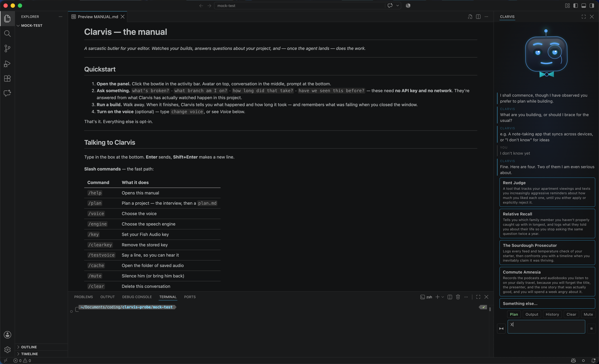

# Clarvis — the manual

*A sarcastic butler for your editor. Watches your builds, answers questions about your
project, plans what you're building, and does the work.*

---

## Quickstart

1. **Open the panel.** Click the bowtie in the activity bar. Avatar on top,
   conversation in the middle, prompt at the bottom.
2. **Ask something.** `what's broken?` · `what branch am I on?` · `how long did that
   take?` · `have we seen this before?` — these need **no API key and no network**.
   They're answered from what Clarvis has actually watched happen in this project.
3. **Run a build.** Walk away. When it finishes, Clarvis tells you what happened and
   how long it took — and remembers what was failing when you closed the window.
4. **Plan something.** On a project with no `plan.md` he offers; otherwise type
   `/plan`. He asks what you're building — "I don't know" is a real answer — and ends
   with a plan he can build against. See *Starting a project* below.
5. **Turn on the voice** (optional) — type `change voice`, or see *Voice* below.

That's it. Everything else is opt-in.

---

## Talking to Clarvis

Type in the box at the bottom. **Enter** sends, **Shift+Enter** makes a new line.

**Slash commands** — the fast path:

| Command | What it does |
|---|---|
| `/help` | Opens this manual |
| `/plan` | Plan a project — the interview, then a `plan.md` |
| `/voice` | Choose the voice |
| `/engine` | Choose the speech engine |
| `/key` | Set your Fish Audio key |
| `/clearkey` | Remove the stored key |
| `/testvoice` | Say a line, so you can hear it |
| `/cache` | Open the folder of saved audio |
| `/mute` | Silence him (or bring him back) |
| `/clear` | Delete this conversation |
| `/history` | Read earlier conversations |
| `/git` | Where you are, in plain words |
| `/branch` | Switch branch (or say "switch to main") |
| `/settings` | Open every Clarvis setting |
| `/model` | Choose models, providers and keys |

**Plain English works too.** "Change the voice", "mute", "show me earlier chats", and
"open the settings" all do the obvious thing. Asking a *question* — "what voice are you
using?" — gets you an answer instead of a dialog, which is usually what you wanted.

**The buttons above the prompt** do the most common things: **Output** (every command
and tool call, as it runs), **History**, **Clear**, **Mute**, and the mode toggle.

**Stopping him.** Click the small square **Stop** in the prompt row, or type `stop` and
press enter. Both do the same thing: he finishes the step he is on and puts the tools
down, and says so once however many times you press it. The button is always there —
greyed out when there is nothing to stop, red when there is. Typing "stop the dev
server" is a job, not an interruption, so that still gets treated as work.

---

**A job that fails on purpose can be dismissed.** He remembers the last thing that
failed and brings it up at launch, which is right for a test you mean to fix and wrong
for a probe or a deliberately red suite — those never clear themselves, because the
record only clears when *that same job succeeds*. Say `forget about the failing build`,
or `/forget`, and it is gone.

---

## Starting a project



Open a project with no `plan.md` and he'll offer, out loud, with **Yes** and **No**
buttons. Say yes — or type `/plan` whenever you want. It all happens in the chat
panel: he asks, you answer in the box, and the options appear as buttons you can
click instead of type.

**If you don't know what to build**, say so. He'll suggest four ideas, at least two
of them genuinely funny, and one of those becomes the starting point. Same at the
name question: eight candidates, three with his own sense of humour, and he'll say
the one you pick back to you with a remark about it.

**He reads the folder first** — an existing `package.json`, a git repo, a README —
so the questions are about *this* project rather than a blank slate.

**Vague answers get pushed back on.** Once, with one specific follow-up: "it takes
everything into account" earns "such as what, specifically?" rather than a shrug.
Answer it and the two get written up as one sentence; leave it blank and your first
answer stands. `I don't know yet` is a real answer throughout — it becomes a recorded
open question, never an argument.

**The language question is a real shortlist**: 2–4 options, each with one genuine
advantage and one genuine cost, never a list where everything looks good. Say
`You pick` and he will, with a reason — and a remark about the trade you just made.

**Then he tells you what's wrong with it.** Safety problems, logic contradictions,
scope quietly bigger than you described. Each finding is yours to **Accept**,
**Reject** (say why — it's recorded, not dropped) or **Modify** (your words replace
his).

**The draft opens in the editor**, rendered rather than raw, while the approval
question stays in the chat. Add anything missing and he redraws; nothing is written
to disk until you choose **Approve**. If a `plan.md` already exists he asks whether
to keep it *before* the interview starts, rather than wasting your time and telling
you at the end.

**The plan has milestones, and each step has a check.** Up to four, the first being
the smallest thing that actually runs, and every step carries the thing that proves it
works — a command and what it should print, not "verify it works". They are written
before any code exists, on purpose: a check invented afterwards describes whatever got
built rather than testing what was meant.

**Then he builds one milestone.** He shows you the exact task before it runs,
editable, with **Not Yet** a perfectly good answer. Approving switches to **Agent**
mode, where he describes each step that changes anything and waits for a yes. The
panel shows which step he is on. Files open as he writes them and the editor jumps to
what changed. If he needs something decided mid-build he stops and asks in the chat,
and your answer carries on the same task rather than starting a new one.

**When a milestone finishes he stops.** What changed, what the checks produced, and an
offer to write it into `plan.md` — steps ticked off, results recorded next to them.
Then the next milestone is offered, never started on its own. That is the loop, and it
carries on until the plan runs out.

**Ask for something new mid-build and he stops.** A correction — "use pytest
instead", "call it something else" — gets folded into the run as you'd expect. But
something the plan does not cover, like "it should also email me the results", is new
scope: he stops, says so, and offers to write it into `plan.md` first, either as
steps on the current milestone or as a milestone of its own. That is §0's rule, and
the point of it is that a plan approved on Monday still describes the project on
Thursday.

**Nothing is lost to a reload.** An interview is saved after every answer, so closing
the window mid-question costs nothing — the next time you plan, he offers to carry on
from where you stopped, throw it away and start fresh, or leave it for now. Same for a
build: if a milestone was part-way through, he offers to pick it up when the window
opens. Both read from what was actually saved, so they survive a restart, a new
machine, and you ticking something off in `plan.md` by hand.

**The plan says how the code should be written, too.** Near the end he asks how chatty
you want the comments — explained throughout, or only where something is surprising —
and neither answer is the right one. That, plus the conventions for whichever language
you chose, goes into the plan as a section you can read and argue with, rather than
sitting in a hidden instruction.

---

## What Clarvis does on his own

He talks unprompted in four situations, and never more than **once a minute** in total
— it's one shared budget across everything below, not one each. Things you need to know
now (a build going red, an error you've hit before) get a shorter floor, so good news
can't crowd out bad.

- **When something finishes.** A build, a test run, a debug session — what happened and
  how long it took. Short commands are ignored; nobody needs a notification for a
  two-second script. *(Threshold: `clarvis.watch.minDurationSeconds`.)*
- **When you open a window.** A short briefing: which branch, how much is uncommitted,
  what was failing when you left, what you last touched. Nothing worth reporting means
  nothing is said.
- **When an error repeats.** The third time the same error catches you in a week, he
  mentions it — and what fixed it last time, if he saw a fix. It's a suggestion. He
  won't act on it unless you ask.
- **Dev-moment commentary.** A slow build, a suite going green, an enormous diff. This
  is the part that's there for fun, and it's the first thing the budget suppresses.

Everything he says lands in the chat transcript too, so a notification you missed is
still there to scroll back to.

---

## Models

`/model` opens everything: providers, models, and keys.

**Picking a provider walks you straight into its models.** Choosing one clears whichever
model was set — a model belongs to the provider that offered it, and carrying one across
means asking OpenAI for a Claude model and getting an error nobody can explain — so the
list of that provider's models opens next, with the key prompt first if it needs one.

**Two models, on purpose.** Chat and coding are configured separately, and the coding
one follows chat until you say otherwise:

| | Used for | Why you'd change it |
|---|---|---|
| **Chat model** | Every question you ask | Every reply costs this one. A small or local model is fine here. |
| **Coding model** | Writing code, running the agent | Needs to hold a tool loop together. This is where the capable model earns its price. |

A cheap model for talking and a capable one for code is the whole point — asking "which
branch am I on?" shouldn't cost frontier prices. The provider can differ too, so a local
Ollama model can answer questions while a hosted one writes the code.

**Providers:** Anthropic, OpenAI, OpenRouter, Ollama and LM Studio. **Keys are kept per
provider**, so switching between them is one click, not a re-entry. They live in your OS
keychain — never in a settings file, never in the log.

**Model lists come from the provider, live.** They're filtered to models that can
actually do the job — on OpenRouter that means only ones that can call tools, which is
about 330 of 400 — and cached for a day. **Refresh** sits inside the picker for when a
provider adds something new. Nothing is hardcoded, so a model released tomorrow appears
without updating this extension.

**Local models need no key at all.** Point Clarvis at Ollama or LM Studio and nothing
leaves your machine.

**No "sign in with Claude."** Anthropic doesn't permit third-party products to use
claude.ai logins or subscription limits without prior approval. Bring an API key.

## Voice

**Off until you turn it on** — a voice that surprises you once is a voice you disable
forever. Clarvis offers to set it up once, on first run, and never brings it up again.

**Turning it on:** add a key with `/key` and voice switches on by itself. No key? The
system voice works with `/settings` → **Clarvis › Voice: Enabled**; it reads the words
but doesn't perform them.

**Two ways to stop him**, and they differ: **Mute** (the button by the prompt, or
`/mute`) silences him instantly, mid-sentence, until you reload the window. Unticking
the setting keeps him quiet for good.

**Two tiers.** Your operating system's built-in voice is free, offline, and always
available; it reads the words but doesn't perform them. [Fish Audio](https://fish.audio)
is the good one, and needs a key of your own.

| I want to… | Do this |
|---|---|
| Pick a voice | `/voice` — highlight a row to hear it before choosing |
| Use my own Fish Audio voice | `/voice` → **Paste a Fish Audio voice ID**, then give it a name to keep it |
| Add my Fish Audio key | `/key` — stored in your OS keychain, never in settings, never logged |
| Change quality vs. cost | `/engine` — defaults to `s2.1-pro-free`, their best model on a free tier |
| Hear a test line | `/testvoice` |
| Silence him right now | **Mute**, or `/mute` — stops him mid-sentence |
| Stop him mentioning a failed job | `/forget`, or "forget about the failing build" |

**Mute is for the next ten minutes, not forever.** It clears when you reload the
window. To turn voice off properly, use the setting.

**Spoken audio is cached** on disk, so a line you've heard before replays instantly and
costs nothing. `/cache` opens the folder; delete anything in there freely.

**What gets spoken:** everything he says. Briefings, build outcomes, chat replies, the
sardonic asides. How *often* he talks is governed by the once-a-minute budget above —
splitting it would mean the voice carried the dull half of the character and the text
carried the funny half.

---

## What he's allowed to do

The toggle above the prompt sets how far Clarvis may go. It is a hard stop, not a
suggestion — a mode that cannot edit has no editing tools at all, so nothing he decides
can get around it.

| Mode | He can | Use it when |
|---|---|---|
| **Auto** *(default)* | Works out whether you asked a question or gave him a job — and checks before each step that changes anything | Most of the time |
| **Unattended** | The same, without checking | A job you're happy to walk away from |
| **Agent** | Everything is a job, and he checks before each change | You know it's work, and want to see it coming |
| **Chat** | Read, answer, and talk about anything else | You're asking, not asking for |
| **Plan** | Read, and describe what he *would* change — staying on the project | You want the plan before the work |

**Chat wanders, Plan does not.** In Chat he'll answer a question about anything —
how something works, an opinion, ordinary conversation — because an assistant that
can only discuss your codebase is a worse assistant. Plan mode is the opposite on
purpose: it is a working session with a document at the end of it, so he answers a
digression in a sentence and brings it back. **Starting an interview switches to Plan
by itself**, and switches back when it finishes.

**Two of these change files without asking you first, and only one of them is
supposed to.** In **Auto** and **Agent** he describes each step that would change
something and waits for a yes; "Skip this step" keeps the run going, and he's told
what you refused so he can find another way. **Unattended** is the one that doesn't
ask — pick it when you want to hand over a job and leave. He says so once when you
choose it.

Reading files is never gated in any mode. Approving a file *read* six times teaches
you to click yes without looking, which is worse than not asking at all.

**Whatever the mode, the gates on irreversible things stay.** Deleting, publishing,
installing — those are a separate layer from per-step approval, and there is no
setting that turns them off.

**One thing worth understanding.** When he reads or writes a file, he cannot leave
your project folder. When he runs a *command*, the operating system holds it to the
same rule: it can't modify anything outside your project and its build caches. That
one isn't a list of forbidden commands — it's enforced underneath, so it works the
same whether something was typed as `rm -rf` or hidden inside a Python one-liner.

Two things it deliberately doesn't stop: **reading** (build tools need to read from
all over your machine) and **network access** (installing packages needs it). So a
command still can't wreck your machine, and could still read something and send it
somewhere.

**On Windows there's no such mechanism.** He asks once, per project, whether to run
commands without it, and remembers your answer. Say no and he simply won't run
commands — everything else still works.

**Ask for work in a read-only mode and he says so**, naming the mode and what to switch
to, then answers the question anyway. Before, he would answer and mention in passing
that he could not edit anything, which left you guessing why.

---

## After he changes something

Every run happens on its own temp branch, so your own branch is untouched whatever
happens. When it finishes you get the choice — never a silent merge:

- **Check it works** — runs your project's tests first, if he can find them. Offered
  first because a change nobody has run is a change nobody knows about.
- **Keep it** — merges the temp branch into the branch you were on.
- **Show me first** — opens the diff and the full set of options.

**Nothing is pushed, ever.** Merging is local, and publishing stays your decision.

**`Clarvis: Undo Last Agent Run`** puts every file back as it was *and* returns you to
the branch you started on. It works once per run — once undone, the snapshot is spent,
so a second press cannot quietly revert work you have done since.

**Files you were already editing are left alone.** If you had unsaved changes in a file
the run also touched, he leaves it out of his commit and tells you, because your edit
and his are now in the same file and only you can untangle them.

---

A folder with no git in it gets the same offer, the first time you ask for a change:
`git init`, explained in one sentence, or "not now" — declined once means not asked
again. Without git installed at all there is no button, just what to install and where.

## Git, without needing to know git

Clarvis uses git to keep your work safe, and tries not to make you learn it.

**`/git`** — *"where am I, and is anything at risk?"* — answered in plain words. What
branch you're on, what's unsaved, whether the shared copy has moved on.

**`switch to <name>`** or **`switch branch`** — changes branch. If you have unsaved
work, Clarvis says what will happen to it *before* moving, and offers to save it where
it is instead.

**Branches, in one paragraph.** A branch is a separate copy of the project's history.
Work done on one doesn't affect the others until you merge it. Clarvis does every task
on its own branch, so if the result is wrong you throw the branch away and nothing of
yours was touched.

### After a task: the review

When a task changes files, Clarvis offers to review the run. Picking **Review the run**
opens a short list, and every option says what it will do:

| Option | What happens |
|---|---|
| **Show me what changed** | Opens the diff. Nothing moves. |
| **Merge into `testing`** | Brings the work onto your integration branch, if the project has one |
| **Merge into `main`** | Straight onto the trunk — it says plainly that this skips the step above |
| **Go back to `<branch>`, keep the branch** | The work stays where it is for later. Nothing is lost. |
| **Stay on this branch** | Carry on here. Anything you commit lands on the agent's branch. |
| **Throw it away** | Deletes the branch and everything on it |

The order is deliberate: looking is first because it can't go wrong, and throwing away
is last because a list that opens with it gets clicked through.

**It warns you before you can make a mess.** If the branch holds commits the task
didn't make — yours, or another session's — it says so before you merge or delete,
because those would go too. If you have unsaved changes, it says those follow you
between branches and aren't part of any option.

### Branch flow

Your project's `plan.md` can describe how work moves through it:

```markdown
## Branch flow

- trunk: main
- integration: testing
- work: clarvis/<task>
```

Clarvis reads this and offers **your** branches as merge targets rather than guessing
at conventional names. When a branch appears that isn't covered, he asks where it fits
and writes the answer in. When one disappears from your machine *and* the shared copy,
he offers to take it out again. Editing that list by hand works exactly as well.

**Nothing here can lose your work without telling you first.** The one thing worth
knowing: changes you haven't saved into git aren't attached to a branch, so they follow
you around until you save them. Clarvis says so whenever it matters.

## Conversations

**Each window starts fresh.** Yesterday's questions were about yesterday's problems.

**Nothing is lost.** The previous conversation is filed automatically when the window
opens — click **History** or type `/history` to read any of the last 20, which open as
an ordinary Markdown tab you can copy from and close.

**Clear deletes.** It asks first, and it does *not* keep a copy in History. That's what
"no undo" means.

---

## Settings worth knowing

`/settings` opens all of them. The ones that matter:

| Setting | Default | What it's for |
|---|---|---|
| `clarvis.voice.enabled` | off | Whether he speaks at all. Mute is the temporary version |
| `clarvis.voice.selectedVoice` | the shipped voice | `system`, or a Fish Audio voice |
| `clarvis.voice.fishAudio.engine` | `s2.1-pro-free` | Quality vs. speed vs. cost |
| `clarvis.voice.savedVoices` | empty | Voices you pasted in and named — edit or delete here |
| `clarvis.voice.dailyRequestCap` | 200 | Stops a runaway bill while you're at lunch |
| `clarvis.watch.minDurationSeconds` | — | Below this, a finished command is ignored |

Settings can be set globally or per project. Clarvis writes to whichever one is already
in use, so a change made in a project stays in that project.

---

## Privacy

- **Your code is never sent anywhere** unless you ask a question that needs a model, and
  then only the context shown to you with the question.
- **Local answers involve no network at all.** No key, no request, no tokens.
- **Keys live in your OS keychain**, never in settings files, never in the log.
- **Everything is per-project** and stays on your machine.

---

## When something's wrong

**"It never says anything."** Check the once-a-minute budget — he may be suppressing.
The **Clarvis** output channel (View → Output → Clarvis) logs every suppression with
its reason.

**"The voice doesn't work."** `/testvoice` and read the output channel. Common causes:
no key set, the daily cap reached, or no audio player on the system.

**"It didn't notice my build."** Commands shorter than the threshold are ignored on
purpose. Also check that terminal shell integration is on — without it, Clarvis can see
that *something* ran but not what it was.

**Anything else** — the output channel is verbose by design and usually names the cause
outright.

---

## Not built yet

Clarvis is under construction, and this manual describes what exists today. The agent
and **project planning** (above) both work end to end — that list used to say
otherwise, twice. Still to come: **voice input**, and
**Tutor Mode** for people learning to program. See the README for progress.
